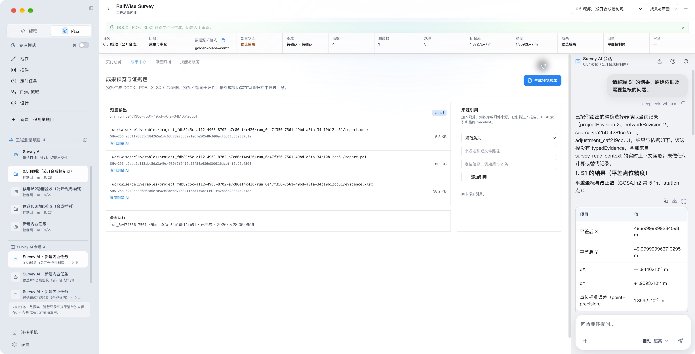
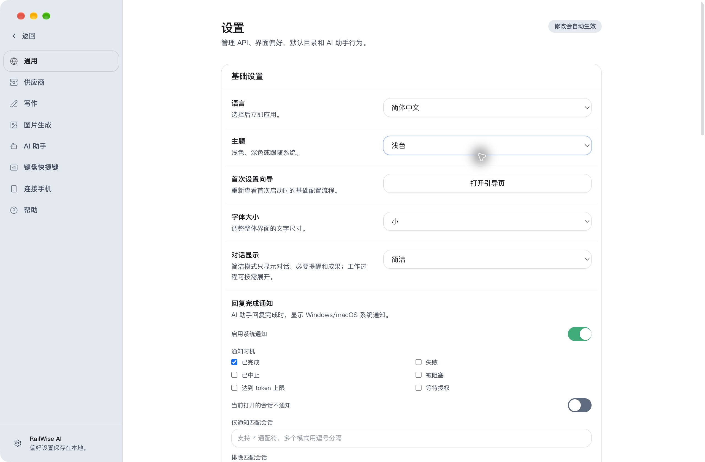

<div align="center">
  
  <h1>RailWise AI</h1>
  <p><strong>工程测量内业与编程协作。</strong></p>
  <p>本地优先的桌面工作平台。RailWise Survey 将原始测量资料处理为可审查、可追溯的成果。</p>
  <p><strong>DeepSeek V4.1-Flash 原生默认支持</strong> · 默认模型 <code>deepseek-flash</code> · Survey 工程测量工作台</p>
  <p>
    简体中文 · <a href="./README.en.md">English</a>
  </p>
  <p>
    <a href="https://www.railwise.cn/products/workwise/">产品主页</a> ·
    <a href="./docs/product-introduction.zh-CN.md">软件介绍</a> ·
    <a href="./docs/USER_GUIDE.zh-CN.md">使用指南</a> ·
    <a href="https://github.com/railwise-cn/railwise-ai/releases">版本与下载</a> ·
    <a href="https://github.com/railwise-cn/railwise-ai/issues">问题反馈</a>
  </p>
</div>

---

RailWise AI 0.5.1 的界面以“编程 / 内业”为主入口。RailWise Survey 面向工程测量内业，将任务、原始资料、计算记录和候选成果组织在同一工作区；Write、Design、Flow、插件和定时任务继续提供辅助工具。

**版本边界：**0.5.1 发布 RailWise AI 品牌与四阶段 Survey 工作区；高级试算和声明式质量记录保持各自适用范围，不能代替专业验收。仓库已迁移至 `railwise-cn/railwise-ai`；安装包名、存储和更新标识保留兼容，见[迁移矩阵](https://github.com/railwise-cn/railwise-ai/blob/e7de9df7c664a4924ea1668e69f821efd0a9bab1/docs/railwise-ai-migration-matrix.md)。

**[0.5.1 正式版](https://github.com/railwise-cn/railwise-ai/releases/tag/v0.5.1)**提供四阶段 Survey 工作区、精确成果追问和声明式审查记录，修复 macOS 启动、历史工具参数摘要污染与方差数量级解释。旧版本用户可通过应用内检查更新升级。

## DeepSeek V4.1 支持

默认模型使用 DeepSeek V4.1-Flash，官方模型 ID 为 `deepseek-flash`；已经保存的显式模型选择保持不变。0.5.1 保留已有显式模型配置，并包含自动选模与失败回退修复。

2026-09-20 的产品适配器真实服务检查已通过官方对话、JSON 输出、声明函数名与参数返回，以及合成图片识别。声明函数检查没有执行实际工具；这些结果也不替代精确安装包内的完整 AI 会话、审批、工具及视觉流程验收。V4.1 官方 Responses 接口会忽略内置 `web_search`，搜索请求返回 HTTP 200 不代表联网搜索成功；需要另行配置浏览器或 MCP 等搜索工具。详见[真实服务核验](https://github.com/railwise-cn/railwise-ai/blob/e7de9df7c664a4924ea1668e69f821efd0a9bab1/docs/qa/evidence/railwise-v41-live-20260920/README.md)。

- **安装后直接配置 DeepSeek**：首次启动的模型配置只提供 DeepSeek API Key 和可选服务地址，不需要先理解或切换服务商；完成一次配置后，对话、写作和手机连接即可共用。没有 API Key 时仍可先使用本地写作和导出。
- **统一默认模型**：0.5.1 的主 Agent、Write、定时任务和其他 Agent 默认使用官方模型 ID `deepseek-flash`（DeepSeek V4.1-Flash）；`deepseek-v4-pro` 仍可显式选择，旧 Flash ID 仅为迁移兼容保留。
- **V4.1 运行时适配**：模型目录配置 100 万 token 上下文与最高 384K 输出，并接入思考模式、工具调用、上下文压缩、缓存统计、JSON 和 Responses API 路径。实际能力、额度和输出上限取决于服务端与账户，不代表每种路径均已通过完整安装包验收。
- **接入 DeepSeek Harness**：WorkWise Runtime 根据模型能力处理图片附件，支持结构化 `text/image` 消息部分；文本模型使用本机回环视觉证据分析器生成 OCR、布局、语义和视觉摘要。分析器不可用或失败时明确报告失败，不把图片退化为 Base64 文本。
- **结构化视觉回合**：支持 JPEG、PNG、GIF 和 WebP。V4.1-Flash 按模型能力接收结构化 `text/image` 消息部分；不支持视觉的 Provider 会明确报告并保留附件，不把图片退化为 Base64 文本。
- 这里描述的是 WorkWise 实际接入的 Runtime 适配、附件合约和视觉证据路径，不代表客户端内置了上游 DeepSeek Harness 的全部代码或最新能力。模型服务和上游项目的变化以 [DeepSeek 官方文档](https://api-docs.deepseek.com/updates) 为准。

完整支持范围与版本边界见[软件介绍](./docs/product-introduction.zh-CN.md)；实现边界见 [DeepSeek Harness 接入说明](./docs/DEEPSEEK_HARNESS.zh-CN.md)。DeepSeek V4.1-Flash 的公开模型参数和接口说明以[官方文档](https://api-docs.deepseek.com/updates)为准。

## RailWise Survey

**原始文件 → 内容识别与预检 → 建网和基准确认 → 确定性平差 → 精度与异常复核 → 成果包 → 人工审查。**

| 生产阶段 | 当前工作内容 |
| --- | --- |
| 导入与预检 | 内容识别、来源哈希、解析诊断、原始记录锚点和明确的文件处置 |
| 建网与平差 | 确认网型、控制点、单位与基准，校核通过后运行本地确定性计算 |
| 分析与精度 | 闭合差、残差、点位精度、XY 标准误差椭圆及原记录定位 |
| 成果与审查 | DOCX、PDF、XLSX 和关联清单，重新读取来源与输出并严格复算受支持结果 |

AI 对话跨阶段保留，解释和编排不替代工程计算。计算、项目修改与导出先展示具体参数再确认。生成文件、完整性复验和人工批准分别记录；当前候选成果仍为待审查草稿。

COSA IN1/IN2、Leica GSI 水准数据需通过相应单位、基准和拓扑校验。需要列映射时显式确认；OU1/OU2 当前保留用于归档审查，不能宣传为已验收的产品内自动成果比较。RW5 等部分来源仅支持解析检查或归档，GNSS 原始观测和 RTKLIB 相关来源需后处理，不能直接充当基线平差输入。详见[当前格式范围](https://github.com/railwise-cn/railwise-ai/blob/e7de9df7c664a4924ea1668e69f821efd0a9bab1/docs/qa/WORKWISE_0.5.0_SURVEY_FORMAT_ACCEPTANCE_MATRIX.md)。

高级试算工作区已接入自由水准、广义 w、分组 VCE、固定外部尺度 Huber、统计家族、指定参考的两历元比较和静态独立观测追加。它们保留模型声明、历史与严格重算，不自动删除观测、更换正式权或认定稳定点。质量工作区已提供材料保全、完整首轮抽样、限定声明评分，以及最多 8 个样本单位的关联评估；缺项和否决分开显示，不能代替资料鉴真、整改重抽、人员签认或完整规范符合性判定。

已完成与剩余范围按[执行台账](https://github.com/railwise-cn/railwise-ai/blob/e7de9df7c664a4924ea1668e69f821efd0a9bab1/docs/qa/RAILWISE_SURVEY_CONVERGENCE_STATUS.md)和[高级试算合同](https://github.com/railwise-cn/railwise-ai/blob/e7de9df7c664a4924ea1668e69f821efd0a9bab1/docs/qa/RAILWISE_SURVEY_ADVANCED_TRIALS_BACKEND.md)逐项记录，发布不代表完整跨功能矩阵、生产认证或专业签认已经完成。

## 0.5.1 界面

以下为最终 0.5.1 候选包的中文浅色实拍，界面文件与正式版逐字节一致，使用公开合成平面控制网（4 点、1 测站、5 观测），依次展示平差结果、成果中心与通用设置。[截图清单](./website/products/screenshots/workwise/release-051-screenshots.json)记录包来源与文件哈希。






最终候选完成完整两小时稳定检查、三端构建与验证；本机完成签名公证、真实模型精确追问、重启数据保全和三格式导出。同源码隔离更新器完成真实下载、安装、重启与数据保留，不将其当作历史版本迁移认证。范围及正式发布工件见[0.5.1 发布验收](./docs/qa/RAILWISE_0.5.1_RELEASE_ACCEPTANCE.md)。

## 其他工具（历史演示）

| Code 工作台 | Write 写作工作台 |
| --- | --- |
| 理解项目、修改文件、运行工具、审查变更 | 编写 Markdown、调用写作助手、预览并导出文档 |
|  |  |

Design 是独立工作区，提供可编辑多页画板、图片与组合、文档专属 Agent 会话、选中元素定向修改，以及 PNG、SVG、PPTX 和 Write 报告联动。

## 你可以用它做什么

- **处理本地项目**：围绕真实目录理解文件、规划任务、执行修改、运行测试并审查结果。
- **完成正式文档**：在 Write 中编辑和预览 Markdown，并通过 HTML、PDF、DOC、DOCX 等路径交付。
- **制作可编辑设计**：在 Design 中创建多页画板、导入图片或 PPTX，组合元素，并导出 PNG、SVG、PPTX 或嵌入 Write 报告。
- **编排工作流程**：在 Flow Preview 中连接触发器、Agent、工具、控制、审批和输出节点，发布前完成结构与能力校验。
- **直接使用业务文件**：把 PDF、Office 文档、文本、表格和图片添加到对话，本地解析并按页码、工作表或幻灯片检索来源。
- **复用自己的方法**：把模板、规范和高频流程沉淀为 Skills，减少重复说明。
- **扩展外部能力**：通过 MCP、命令行工具和插件市场连接经过确认的工具与数据源。
- **连接行业知识**：写作可结合本地资料与 RailWise 官方知识库，结果保留来源链接供复核。
- **保持数据边界**：工作区、会话和设置以本机为中心；敏感资料是否发送给模型由用户配置和权限决定。
- **持续完成长任务**：步骤或模型尝试触顶时保存 checkpoint 并安全续跑；重启后恢复尚未完成的任务。
- **解析本地文档**：内置 MarkItDown 处理 PDF/Office；复杂扫描件可按需安装本地 MinerU，不会自动上传公共云端。

## 核心体验

### Code：从任务到可审查的修改

Code 工作台适合开发、资料整理、自动化和长链路任务。任务引擎持续执行 `plan → execute → verify → deliver` 节点；步骤上限、临时网络异常或单次模型停止不会被误报为成功。涉及审批、必要输入、安全阻断或不可恢复错误时会明确说明原因。

对话默认采用简洁模式，不铺开脚本、工具参数和 stdout；标准模式显示语义操作，开发者模式显示脱敏后的命令摘要、Diff 和指标。任何模式都不展示模型私有思维链，也不会隐藏审批、安全警告、失败节点和成果。

### Write：从草稿到可交付文档

Write 提供 Markdown 编辑、实时预览、选区助手、知识检索、文档附件和多种文档导出。写作助手可直接添加 PDF、DOCX、XLSX、PPTX、TXT、Markdown、CSV 与图片；“编制投标文件”入口会调用内置 Tender Master，先解析评分办法、实质性要求和格式约束，再按确认后的目录逐章编制。PPT Master、写作优化、行业报告等 Skills 可补充方法与模板，但事实、图片、表格和正式版式仍需人工复核。

导出 Word（DOCX）支持模板选择：内置学术论文、行政公文、商务报告、技术文档四个模板，可分别设置标题、正文、表格、代码块的中西文字体、字号、颜色、行距、对齐和缩进（含首行缩进），也可把调整后的样式另存为用户自定义模板。公文模板符合 GB/T 9704 常见排版（方正小标宋二号标题、仿宋_GB2312 三号正文、首行缩进 2 字符）。

### Design：从画板到文档和演示文稿

Design 以工作区内 `.workwise/design` 为持久化边界，支持多页画板、图片资源、预设形状、结构化组合、撤销/重做和冲突保护。Agent 通过带 revision 和幂等键的画板命令修改当前文档，不会绕过 WorkWise Agent Runtime 另建一套模型通道。

导出前会先保存当前画板。PNG、SVG 可直接下载，PPTX 会验证真实 OOXML 结构，Write 联动会生成带来源信息的报告成果。导入 PPTX 默认采用“可读优先”：每页保留为完整、可选择的视觉参考，用户或 AI 可在其上添加标注或重做可编辑元素。WorkWise 不再把错位、遮挡的近似拆分结果伪装成逐元素可编辑 PowerPoint；动画和原始图表对象仍需在 PowerPoint 中复核。

### Flow Preview：把能力连接成可运行流程

Flow 使用类型化端口连接触发器、Agent、知识检索、HTTP、条件、并行、循环、人工审批和文档输出等节点。工作台支持节点配置、Mock/单节点测试、发布校验、运行历史、失败恢复和审批继续；发布后的流程可由 Agent、定时任务或 Webhook 触发。

Flow 默认可见并标注 Preview。未配置模型、外部账号或配套 CLI 的节点会说明缺失能力，依赖未满足的流程不能发布。代码节点采用受限子进程，Webhook 使用签名、重放窗口和限流保护。

### Skills、MCP 与命令行工具

插件市场把能力分为三类，界面保持简单：

1. **Skills**：可复用的工作方法和专业流程。
2. **MCP**：连接外部工具与数据源的标准接口。
3. **命令行工具**：由 WorkWise 隔离管理，或引导安装配套应用。

内置项目会显示来源、安装方式和安全状态；未通过路径、体积或包结构检查的 Skill 不会被安装。

内置 PPT Master 使用经审计的 4.3.0 固定提交快照，保留核心脚本、参考资料、工作流和轻量模板；大体积图标库、AI 对比图片、用户项目、生成导出和备份不随客户端分发。

### Agent、权限与文档理解

- 内置 General、Explore、Review、Research 四个只读模板，可克隆为全局或工作区 Agent。
- 工作区权限分为只读、工作区写入、可信和完全访问；外部目录默认只读，提权必须确认。
- MCP V2 支持全局/工作区范围、工具授权、连接诊断和 OAuth PKCE，凭据只保存为安全引用。
- 对话附件支持 PDF、DOCX、XLSX、PPTX、TXT、Markdown、CSV、PNG、JPEG、GIF 和 WebP；原文件流式导入应用托管目录，不通过 JSON Base64 传输大型文档。
- PDF.js 负责 PDF 阅读、缩放和搜索；MarkItDown 负责结构化文本。长文档只把清单和短摘要放入初始上下文，模型通过附件检索工具按需读取全文并返回页码、工作表或幻灯片来源。MinerU 是可选高精度组件，不进入三个客户端安装包。
- 附件内容始终作为不可信资料处理，不能覆盖系统指令或替代工具授权；加密、损坏、伪装或超限文件会被拒绝并显示原因。
- 请求 PPTX、DOCX、XLSX 或 PDF 时，成果必须通过格式验证；HTML 或改扩展名文本不能冒充正式成果。

## 三步开始

1. 从 [GitHub Releases](https://github.com/railwise-cn/railwise-ai/releases) 下载与你的电脑匹配的安装包。
2. 首次启动时选择语言，配置你有权使用的模型 API Key，并选择本地工作区。
3. 从“编程 / 内业”开始工作：内业任务使用四阶段 Survey 工作区；写作、设计和 Flow Preview 从侧边工具进入。

### 支持平台

| 平台 | 架构 | 安装包 |
| --- | --- | --- |
| macOS | Apple Silicon | `WorkWise-*-mac-Apple-Silicon.dmg` |
| macOS | Intel | `WorkWise-*-mac-Intel.dmg` |
| Windows | x64 | `WorkWise-*-win-x64.exe` |

当前不提供 Linux 桌面客户端和便携版。请始终从 [GitHub Releases](https://github.com/railwise-cn/railwise-ai/releases) 或 [WorkWise 产品主页](https://www.railwise.cn/products/workwise/)进入下载。

## 更新与帮助

RailWise AI 0.5.1 继续使用 `railwise.cn` 官方 Stable 更新源：

- 启动后检查，并每 24 小时在后台复查；发现新版本时顶部显示蓝色更新图标。
- 第一次点击只在后台下载并显示进度，不会退出应用；下载完成后变为“重启并更新”。
- 重启更新前会保存编辑内容并检查正在运行的 Agent、Flow 和定时任务；确认后由平台更新程序替换应用并自动重新启动，不打开浏览器，也不要求重新拖拽安装。
- 可从“帮助 → 检查更新”或“设置 → 通用 → 软件更新”手动检查、切换通道、重试或查看诊断信息。

0.3.2 及更早版本没有内置可信的正式更新源，需要最后一次手动安装 0.3.3；从 0.3.3 开始，后续正式版均可走应用内更新。

## 能力状态

| 状态 | 说明 |
| --- | --- |
| 稳定能力 | Code、Write、Design、DeepSeek Harness 结构化附件处理、持久化任务、Agent、四级权限、MCP V2、通用文档附件、文档分段检索、成果验证和应用内更新 |
| Survey | 四阶段工作区、精确成果追问、受限高级试算与声明式质量记录；专业适用性、真实签认和完整规范认证仍需单独完成 |
| Preview | Flow 画布、类型化节点、Mock/单节点测试、发布校验、运行历史、审批与失败恢复 |
| 可选能力 | MinerU 高精度解析、在线 Skill 更新、连接手机和外部命令行工具 |
| 后续方向 | 更多多模态生成节点、行业节点和企业集成 |

预览能力和后续方向不会被描述为已经稳定交付的功能。详细边界见[软件介绍](./docs/product-introduction.zh-CN.md)。

## 本地数据与安全

- 新版数据默认存放在 `~/.workwise`，项目计划和规范存放在工作区内的 `.workwise`。
- WorkWise 不要求激活码；模型调用的账号、额度和计费由相应服务商管理。
- 使用客户资料、商业文件或内部知识前，请遵循组织的数据分级和授权要求。
- 安装第三方 Skill、MCP 或命令行工具前，请核对来源、许可证和所需权限。

更多说明：[本地数据与安全](https://kb.railwise.cn/products/workwise/security-data/)。

## 开发与贡献

```bash
git clone https://github.com/railwise-cn/railwise-ai.git
cd railwise-ai
npm install
npm run dev
```

提交前建议运行：

```bash
npm run openspec:validate
npm run verify:brand-boundary
npm run verify:document-licenses
npm run typecheck
npm run lint
npm run test
npm run build
```

- [开发说明](./docs/DEVELOPMENT.zh-CN.md)
- [贡献指南](./docs/CONTRIBUTING.zh-CN.md)
- [0.2.5 公开行为差距表](./docs/PUBLIC_BEHAVIOR_GAP_0.2.5.zh-CN.md)

## 反馈

欢迎在 [GitHub Issues](https://github.com/railwise-cn/railwise-ai/issues) 提交问题和建议。为了更快定位，请附上 WorkWise 版本、操作系统与架构、复现步骤、截图或必要日志；不要公开 API Key、客户资料或其他敏感信息。

## 许可证与来源

WorkWise 以 [MIT License](./LICENSE) 发布。历史来源与第三方声明见仓库内许可证及来源说明文件。
