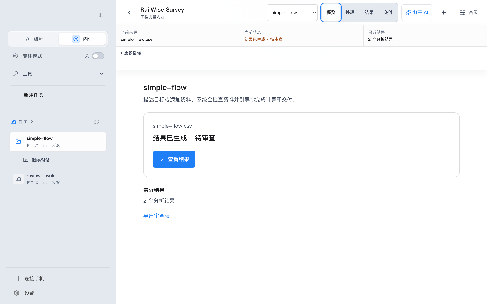
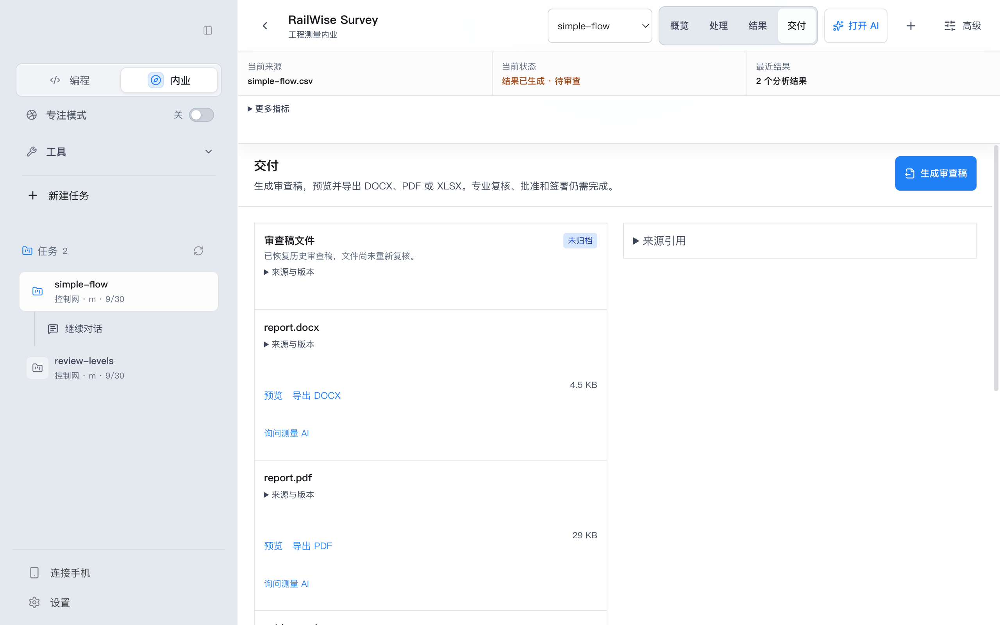

# RailWise Survey 简化工作台：实现与验收记录

> **当前状态（2026-10-06）**：公开 0.5.2 已于 10 月 5 日发布。实际公开包复查再次发现专业 AI 语义、报告技术附录和计算资格文案缺陷，见[实际复查](evidence/railwise-public-052-cua-20261005/)。本轮修复必须进入新的冻结、签名候选，完成真实模型问答、DOCX/PDF/XLSX 回读、主题/语言/尺寸/键盘与恢复矩阵、独立高级工程师模式 AI 审查及真实 updater 往返，才可宣布当前实现验收完成。未覆盖或重发公开 0.5.2。

> **历史快照（2026-10-04）**：简化导航、专业文案过滤和来源重连保护已在源码中实现并通过定向回归。当时的候选 `0.5.1` arm64 的 app.asar SHA-256 为 `023ca43ca76ba88ac9dfd54c00aca1cd8ea188678e5993d9dbb734db65e619dd`。本文后面的 48 屏记录属于历史候选，不能替代后续源码的完整验收。

2026-09-30 产品方向修订：用户指出本版专业性不足，要求对照 COSA、测量云的处理步骤与成果。后续以[专业流程调研与 AI 修订方案](../RAILWISE_SURVEY_PROFESSIONAL_WORKFLOW_RESEARCH.zh-CN.md)为依据：网形、基准、闭合检核和专业成果恢复到主流程，技术执行细节继续折叠。下文保留本版实现及有限验收的历史记录，不代表用户已接受该设计，也不以动作数量替代专业成果验收。

状态：代码已实现。当前源码的私有重建包已完成 ASAR/签名和直接启动检查；静态结构与历史界面的独立 AI 高级工程师模式复核已归档。精确重建包仍因本机 LaunchServices/CUA 绑定超时，未取得可接受的当前包截图，不能宣称安装包验收完成。未进行公开发布。

## 本轮交付

- 主导航收敛为「概览 / 处理 / 结果 / 交付」。顶部保留当前来源、当前状态、最近结果三个摘要。
- 编程、内业保留一级入口；写作、设计、Flow、插件、定时任务放入「工具」。侧栏按任务组织会话。
- 上传、自动预检、问题确认、计算、结果形成连续流程。任务名称可以由首个文件名生成；警告统一确认，计算前显示来源与单位。
- CSV/XLSX、仪器源文件和 AI 上传使用统一分流入口。CSV 按表头识别；XLSX 默认监测数据，也可显式选择测量来源。解析、单位、基准、准入仍由本地计算服务判定，不把前端推测当成已验证信息。
- AI 改为可开关抽屉，保留未发送草稿。执行方案默认显示目标、输入、预计结果和进度；工具参数、运行 ID、哈希、历史记录进入详情。普通可逆方案一次确认；高风险或不可逆步骤保留必要确认。
- 测量默认展示资料识别、数量、基准、单位和计算状态；专业分区、自由试算、字段映射、JSON、原始记录和算法追溯通过高级入口访问。
- 成果预览、导出、审查和归档入口合并。文件列表默认显示文件名；内部路径、运行编号、SHA-256 等放入「来源与版本」。
- 品牌读取集中配置，增加图标注册表及未知、空、加载失败图标的回退。修正侧栏折叠语义和方向、标题栏与刷新图标点击范围。
- 使用原生 dialog 保持焦点范围、支持 Escape 和焦点返回。保留状态播报、文字状态与表格横向滚动。
- 清理过时的 engineering-agent 样式，添加本地导入耗时、首次结果动作数、返回次数、恢复成功/尝试和高级入口使用计数。仅保存聚合值，耗时/动作样本上限 50，不上传遥测或存储目标、文件内容、项目 ID。

## 兼容范围

| 旧入口 | 当前显示位置 |
| --- | --- |
| dashboard / ai-command | 概览 / AI 处理抽屉 |
| project | 高级 → 项目配置 |
| data / source / quality | 处理 → 导入、预检、问题确认 |
| survey / advanced-models | 处理 / 高级模型 |
| precision / analysis | 结果 |
| deliverables / review | 同一交付页；审查和归档按需展开 |
| skills | 高级 → 技能与规范 |

保留全部旧 tab ID、持久化阶段键、深链事件及内部 API。未删除插件、MCP、Skill、配置读取器、项目、运行记录或成果；没有更改目录迁移和许可证策略。原工作区既有修改和 QA 证据均保留。

## 自动化验证

| 检查 | 结果 |
| --- | --- |
| 完整回归（流程与交付收尾之后） | 338 个文件通过，2 个文件跳过；2,895 项测试通过，2 项跳过 |
| 标题栏与 UI 收尾后的相关回归 | 39 个文件、473 项测试通过 |
| TypeScript 检查、构建 | 通过 |
| ESLint | 无错误；保留既有 Workbench.tsx:1406 的 setInput 依赖警告 |
| 品牌边界、git diff --check | 通过 |
| 私有候选来源核对 | 34 个变更/新增 src 文件与候选快照逐字节一致 |

日志位于 [最终证据目录](evidence/survey-simple-ui-1c21992e40c0/)。最后的刷新按钮修正仅将尺寸类改为最小尺寸类，随后重新打包并重跑完整视觉矩阵。

## 真实打包应用检查

使用安装后的 arm64 macOS 应用和真实本地计算服务。通过应用调试连接操作渲染界面、通过 macOS 窗口控制及原生保存对话框操作桌面；最终矩阵未使用浏览器尺寸模拟或前端 mock。

- 1280×800、1440×900、960×800 原生窗口 × 中文/英文 × 明亮/深色 × 四个页面，共 48 组截图。使用标准字体缩放。
- 自动几何检查：全部组合无页面横向溢出、缺失图片、无标签图标按钮或小于 44px 的可见图标点击区域；默认页面未出现 Typed Plan、TaskRun、contextHash 或运行编号。专业表格保留内部横向滚动。
- 已查看四份截图总览，并单独检查交付页、AI 抽屉和高级抽屉。补充保存最大化窗口及「工具」菜单截图。
- 新任务实测：**新建任务 → AI 上传 CSV → 确认一次警告 → 开始计算**，共 4 个主动作。自动预检完成后直接到结果，无强制项目配置步骤。
- 实测数据包含 4 条观测，得到 P01 = 0.001 m、P02 = 0.002 m。阈值未配置仍标为待确认，没有误报为正常。
- 候选包更换并重启后，测试项目、计算结果及既有审查稿均保留。
- AI 抽屉连续 30 次 Tab 均未跳出；Escape 返回触发按钮；关闭重开后草稿保留。高级抽屉焦点进入与返回通过。
- 最终包实际生成并通过系统保存对话框导出 DOCX、PDF、XLSX。文件存在、容器结构有效，导出 SHA-256 与交付页记录一致。
- PDF「预览」动作获得系统打开成功回执；未取得外部阅读器的渲染截图，不把这一项当成外部阅读器排版验收。

完整结果：[视觉矩阵](evidence/survey-simple-ui-1c21992e40c0/visual-matrix.json)、[功能与导出记录](evidence/survey-simple-ui-1c21992e40c0/functional-acceptance.json)。

### 主要界面

[中文明亮总览](evidence/survey-simple-ui-1c21992e40c0/contact-zh-light.jpg) · [中文深色总览](evidence/survey-simple-ui-1c21992e40c0/contact-zh-dark.jpg) · [英文明亮总览](evidence/survey-simple-ui-1c21992e40c0/contact-en-light.jpg) · [英文深色总览](evidence/survey-simple-ui-1c21992e40c0/contact-en-dark.jpg)

## 私有包信息及待确认项

2026-10-02 当前工作树重建包（源码含未提交改动，不能视为可发布来源）已记录在[当前重建证据](evidence/survey-acceptance-be1d6fef/current-source-rebuild-20261002.json)：版本 `0.5.1`，arm64，ZIP SHA-256 为 `365fdbc9c03d809bdfff1edecc6fb6b6b12eac9a0e4f243b0b25c89e7de65174`，ASAR 完整性和 ad-hoc 签名通过，未公证；精确路径 CUA 返回 `-10005`，未执行 updater 往返。该工件只用于当前源码诊断，不能替代安装包 UI 验收或发布候选。

- 包版本：**0.5.1**，未更改公开版本。
- 源码快照：`1c21992e40c09c25db4a91920ca89eb7e3c52e9e`，位于已有私有候选 worktree；原工作区未提交、推送或覆盖其他工作。
- 安装位置：`/private/tmp/railwise-survey-ui-candidate/installed/RailWise AI Candidate 1c21992e40c0.app`。
- 独立 bundle ID、候选 user-data/home/cache/logs、回环更新地址；外部连接、入站接入和生产凭据访问关闭。
- `codesign --verify --deep --strict` 通过；签名为 **ad hoc**，未取得 Apple 公证票据。
- [包校验记录](evidence/survey-simple-ui-1c21992e40c0/package-inspection.json) 包含来源、版本、bundle ID、ASAR 哈希和启动结果。

尚未覆盖的验收：当前源码精确包的 CUA 界面/功能矩阵（受本机 LaunchServices 绑定超时阻断）、真实外部模型生成并执行方案、所有专业仪器格式的本地全流程、真实用户资料迁移、屏幕阅读器人工试听、外部阅读器排版和真实更新往返。失败、离线、过期、恢复和兼容分支已有自动化覆盖，不能替代上述真实验收。常规 UI/功能验收由 CUA 与独立 AI 高级工程师模式复核完成；AI 复核不替代厂商/SUC 互操作证据、真实专业签认或公开发布的版本/动作批准。

本地统计用于后续观察，尚无真实用户样本可以证明整体效率提升；导入耗时目前记录导入请求耗时，不等同于新用户从启动到首次结果的总耗时。

依据项目 AGENTS.md，当前交付状态为**可供用户验收的私有实现**，不是公开发布或最终验收通过。没有创建/移动 tag、发布 GitHub Release、提升公开 feed 或更新官网下载页。
