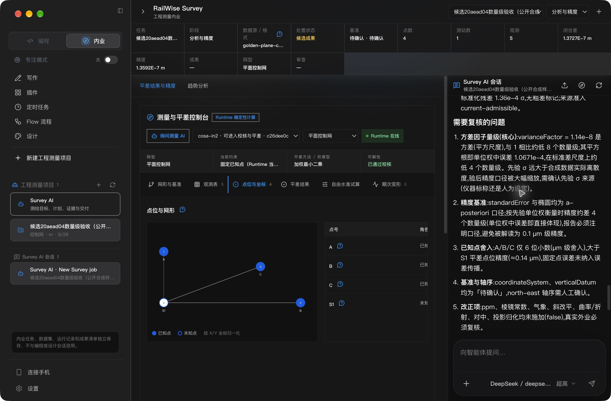
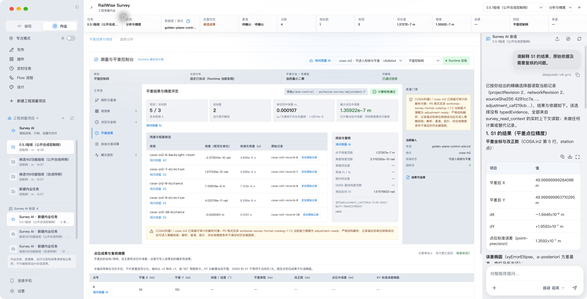
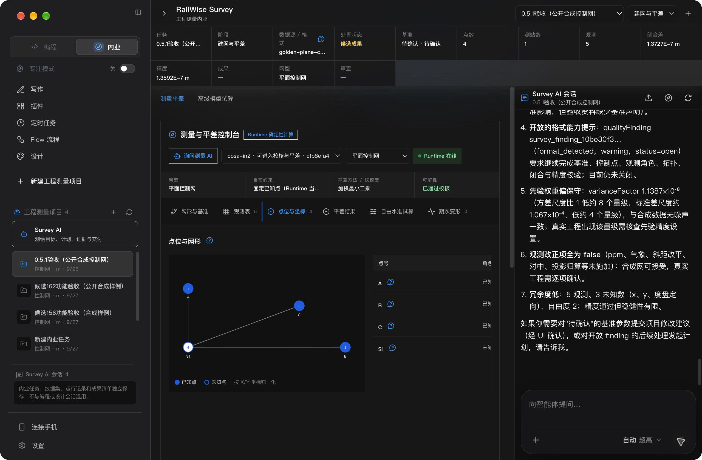

# RailWise AI 0.5.1 / 20aead04 最终续验

源码：`20aead04af10d72cf1e33c1b61c7b81306ff05a6`；日期：2026-09-28（北京时间）。

**当前状态：#166 三端最终候选、完整两小时稳定检查、本机最终包安装、两次真实模型问答、重启保全和实际成果导出均通过；#165 同源码私有 updater 六阶段通过。用户已确认继续发布 0.5.1，正在执行正式发布准备；PR #28 已合并，`v0.5.1` 标签已固定在 `4bcc09fee46dfa4231a0b53905ffa2068c3f88c1`，正式 stable 构建/发布运行中。**

本轮修复 #162 的数量级解释错误：系统说明明确区分方差与标准差，`1.14e-8` 方差相对 1 约低 8 个数量级，其平方根约低 4 个数量级。没有修改确定性计算结果或已保存的旧回答。旧失败证据见 [#162 报告](../railwise-051-final-8d68df67/README.md)。

## 源码与工件

- [PR #28](https://github.com/railwise-cn/railwise-ai/pull/28)，HEAD `20aead04`。
- [PR Quality](https://github.com/railwise-cn/railwise-ai/actions/runs/36339828655)、[push Quality](https://github.com/railwise-cn/railwise-ai/actions/runs/36339825669)全部通过，包含质量、Windows 和 Electron smoke。
- 定向 Runtime 21 项通过，Runtime 类型/构建、桌面类型检查通过。桌面全量本机受限环境 2858 通过、10 失败、4 跳过；失败为回环监听 `EPERM 127.0.0.1`，不把该本机运行写为全通过。
- [隔离候选 #164](https://github.com/railwise-cn/railwise-ai/actions/runs/36340558856)已成功。
- [真实私有 updater #165](https://github.com/railwise-cn/railwise-ai/actions/runs/36342879401)已成功。
- [三端最终候选 #166](https://github.com/railwise-cn/railwise-ai/actions/runs/36343000275)使用 `candidate_only=true`、`skip_stability=false`。2026-09-28 03:23:24 至 05:23 执行完整稳定测试并通过；[原始工作流状态](stability-passed-workflow.json)已保存，随后三端组件、Windows、macOS Intel/arm64、最终 DMG 和三客户端验证全部通过，见 [最终工作流](final-candidate-workflow.json)。

## #164 隔离安装及真实模型问答

版本 0.5.1，bundle `com.wangjiawei508.workwise.candidate.head20aead04af10`。DMG SHA256 `65c5a9340876728d99d5f538f97a726b296cf11ba041038254efcd75bb6ef65d`；ASAR SHA256 `1faff330c8e77e7963ccc2b0921c7bcd22b5613701e0e4c672116cb30553a03c`。Runtime 位于 ASAR 外，另核对 orchestrator SHA256 `6fb0de50d20b9580c632039ad36bede9d11dd2daefdc25ac62e5aebe44f1cbf4` 及新说明实际存在。

安装到 `/Applications/RailWise AI Candidate 20aead04af10.app`，实操使用同签名副本 `/private/tmp/railwise-051-fix-candidate/local/RailWise AI Candidate 20aead04af10.app` 与同级 `candidate.env`。首次缺少隔离环境时主动退出，不能称作启动通过；补齐隔离环境后启动、Runtime 在线、正常退出与再启动通过。临时目录下分别隔离 userData、home、日志、缓存、工具目录，IM 入站/出站均禁用。

非受限主机上的深度严格签名和 stapled 公证检查通过。受限沙箱最初返回签名/LaunchServices 读取失败，原输出保留在 [本机身份记录](isolated-local-package-identity.json)，不将沙箱失败解释为包被修改。当前主机 Gatekeeper 原为 disabled，未改变；本机 spctl 的 override 不能代替启用策略验证，云端 #165 的启用策略单独通过。

只在隔离候选中新建公开合成工程“候选20aead04数量级验收（公开合成样例）”，导入仓库 `golden-plane-control-e2e.in2`，来源 SHA256 `4281cc7a10673570756867e8c8665f22f82611839bd34c396a5eba9dbb89d9f0`。未重放此前私有会话。使用既有 `api.deepseek.com / deepseek-v4-pro` 配置，证据不包含凭据。

| 检查 | 实际结果 |
| --- | --- |
| GUI 导入、校核、平差 | 4 点 / 5 观测；网络 `network_0079743b-35f3-423e-af60-2b0fc26dee0c` rev2；平差 `adjustment_525e4c5e-7bf9-42cd-87b2-6654de84806c` rev1 completed、valid。 |
| 原数值 | 方差因子 `1.1387378096796804e-8`，S1 平差 `(49.99999999284098,49.999999963710295)`，点位中误差 `1.3592152495710963e-7 m`。 |
| 首次 legacy 追问 `turn_tjp3v8n2` | 点击 S1 平差成果行生成原问题及引用后发送；一次 `survey_read_context` 成功；可见回答正确区分方差 8 / 标准差 4 个数量级。 |
| 重启后 typed 追问 `turn_bhitjlkh` | 点击 S1 原始点行生成原问题及引用后发送；一次 `survey_read_evidence` resolved，精确绑定 unknownPoints[0] / S1 / rev2 / 来源摘要。回答明确初始点来自本轮 typed 读取，平差来自早前会话上下文，数量级正确。没有再次调用 context 工具。 |
| 只读与恢复 | 正常重启后同项目、语言及历史恢复。重启与第二轮问答后 9 个业务 SQLite 逻辑摘要全部等于重启前基线。 |

两轮均使用原问题“请解释 S1 的结果、原始依据及需要复核的问题。”，未手工补正提示词或引用。没有新计算、错误工具结果或重试。持久化工具原始参数被隐私机制清空为 `{}`，因此不能从保存参数直接证明无污染；精确读回依据工具成功返回的记录/引用和 GUI 行选择。参见 [可见消息与工具结果](real-model-readback.json)、[摘要](real-model-summary.json)、[重启对比](restart-data-comparison.json)、[问答后对比](read-only-data-comparison.json)。导出排除隐藏推理。

03:32 在该新合成项目内显式点击“生成预览成果”，实际生成运行 `run_7b0a670a-b8d4-4890-90d7-be9e20172112` 的 DOCX、PDF、XLSX。文件哈希与 GUI 一致；PDF 两页均完成实际渲染检查、DOCX 文本与 XLSX 15 张工作表可解析，S1 坐标、方差、标准差和误差椭圆与运行结果一致。文件保持待审查草稿、未归档，未授予批准。见 [文件内容及摘要](isolated-deliverable-validation.json) 和 [实际 PDF](isolated-deliverables/report.pdf)。该预览是完成上述只读对比之后的有意写入，不能继续声称当前数据库相对预览前完全未变。

隔离包另做浅色常规/960×840窄窗和系统深色最大窗口预检，截图实际像素与范围见 [UI 预检记录](isolated-ui-preflight.json)。960×640 的自动拖动未成功，未计作通过；该预检不代替 #166 最终界面矩阵。退出设置返回后预览文件列表为临时空状态，但最近运行和已生成的磁盘文件保留，不声称临时预览状态已恢复。检查结束恢复 system 主题并正常退出，候选进程已全部结束，见 [退出记录](isolated-after-preflight-quit.json)。

## #165 同源码真实原生更新

[private-updater.json](updater/private-updater.json) 与 [native-updater.json](updater/native-updater.json) 均为 passed。2026-09-28 03:21（北京时间）完成 `base_started → update_available → download_completed → install_requested → target_relaunched → user_data_preserved` 六阶段，随后 cleanup 完成。

基线 0.0.0 → 目标 0.5.1，使用同源码隔离 bundle 和证书固定的回环 HTTPS。真实 manifest 和 ZIP 各请求一次，共 303007581 字节。ZIP SHA256 `319b31746ef049b9176d9f092d7091f301d2dc22fbc6e65fe025ed4a8982a509`，目标与安装后 ASAR SHA256 均为 `6a65d441224c0135fba251bb5e8f18fa05cdd134f5099716cf96a16750d467f2`。签名、公证和启用的 Gatekeeper 均通过，数据哨兵保留，未打开浏览器、未修改系统信任、未触碰生产或上传公共 feed。

这是同源码隔离探针，不是历史版本数据迁移，也不是正式身份 #166 的相同二进制。`frontier` 仅为回环探针标签，没有推广公共渠道。`package-evidence.json` 保留 #164 构建时的原始 `not-tested` 字段，本报告及后续文件补充本机检查，不改写原始云端记录。

## 当时待完成项（后续进展见文末）

正式发布流水线、正式 feed 安装包复核和官网更新仍待完成。用户此前已确认 0.5.1 界面与继续发布；#166 与其确认的 #162 全部 454 个 renderer 文件及 ASAR 字节一致，此后变更仅为模型方差说明。未声称用户再次亲自操作了 #166。既有 P1/P2、跨功能全矩阵、真实设备/生产及专业签认边界仍按 [总待办](../../RAILWISE_SURVEY_REMAINING_WORK.md) 保留，本轮不宣称全部完成。

安装前保全已完成：原正式身份 #162 应用已从原生菜单正常退出，退出前后 9 个业务库逻辑摘要一致，见 [安装前基线](data-audit-before.json) 和 [退出后对比](data-audit-after-old-quit.json)。旧应用完整副本保存在 `/private/tmp/railwise-pre166-backup/RailWise AI.app`，ASAR SHA256 `395437bb3792154721af8522f74154c12ecaec3c5d44b806767a72ad992bffd9`。9 库另以 SQLite 只读 backup API 留存本机恢复副本，目录 0700、文件 0600，见 [备份摘要](preinstall-backup.json)；报告不包含业务记录明细或凭据。#166 稳定测试实际步骤始于 2026-09-27 19:23:24 UTC，固定窗口最早于北京时间 05:23:24 结束，之后才进入打包。

## 发布前官网准备（历史记录）

现网 0.5.0 的产品页和三端安装包 Range 检查通过，下载区仍为 `WorkWise v0.5.0`，页首为历史候选介绍。仓库新版页面已采用 RailWise AI，因此全量正式页更新时，发布校验需按 manifest.name 匹配品牌。仅在临时目录准备了官网文案与校验修正，未修改冻结的远端分支或现网。新品牌校验对现网返回品牌文案不匹配；随后已核对下载区仍保留旧品牌，原版校验通过，不将该差异记为现网下载故障。

待发布稿：`/private/tmp/railwise-051-publish-notes-prepared.md`；官网页面：`/private/tmp/railwise-051-product-page-prepared.php`；官网校验脚本：`/private/tmp/railwise-051-product-publish-script-prepared.mjs`。页面预留 `07-survey-051-zh-light.jpg`、`08-survey-051-delivery.jpg`、`09-survey-051-settings.jpg`，必须由最终安装包的实际截图补齐后才能部署。官网 manifest 的版本、不可变下载地址、大小、SHA256 和 releaseCommit 均须从正式发布工件填入，不使用私有候选哈希。

已确认的 #162 界面另保存 454 个 renderer 文件的摘要清单，见 [renderer 基线](reviewed-162-renderer-manifest.json)。最终候选及正式包将与之比对；摘要相同只能说明界面文件一致，不代替最终包实操。

## #166 最终正式身份包实操完成

安装 `/Applications/RailWise AI.app`，版本 0.5.1，bundle `com.wangjiawei508.workgpt`，arm64，Developer ID / Team `R35G7F4A9U`。DMG SHA256 `74678d53e37ffdc0a9599fb28ae353238c01c84865c18b98e66596b1421282ad`，已验证成员 CRC 和 SHA256SUMS；采用 ZIP Range 提取，没有宣称整份外层 ZIP 摘要校验。严格深度签名、stapled 公证、Electron/V8 entitlements 均通过。主机 Gatekeeper 原为 disabled，未变更；启用策略由 #165 云端验证。候选 feed 仍为私有 `https://127.0.0.1/`，不把候选二进制推广 stable。

已安装 ASAR `395437bb3792154721af8522f74154c12ecaec3c5d44b806767a72ad992bffd9` 与用户已确认 #162 完全一致；454 个 renderer 文件也逐一相同。外置 orchestrator `6fb0de50d20b9580c632039ad36bede9d11dd2daefdc25ac62e5aebe44f1cbf4` 与已实操 #164 相同。见 [身份验证](local-package-identity.json)、[最终 renderer](final-166-renderer-manifest.json)。

本轮在正式身份中新建公开合成工程 `project_fdb89c5c-a112-4908-8702-a7c86ef4c420`，不重放历史私有会话。GUI 导入、校核、平差结果为 4 点 / 5 观测，S1 坐标与上述隔离包一致。

- 第一次结果行追问 `turn_ttujsfix`：实际两次成功 `survey_read_context`，没有失败调用；按 callId 去重后为两次，不误报一次。回答正确区分方差 8 / 标准差 4 个数量级。
- 正常退出及重启后返回“内业”，原工程和完整历史保留，Runtime 在线。应用初始落在编程概览，需要点击内业，不声称自动恢复原顶层视图。
- 第二次原始点行追问 `turn_qn1mze7l`：原问题与 UI 自动引用未经手工修改，一次 `survey_read_evidence` resolved，准确返回 S1 / unknownPoints[0] / projectRevision 2 / networkRevision 2 / 源 SHA256。回答区分本轮原始点读取与此前平差上下文，数量级正确。
- 有意生成成果后建立新的重启基线；退出、重启、只读问答三个时点 9 个业务 SQLite 逻辑摘要全部一致，无新增、删除或改动。见 `data-audit-after-final-quit.json`、`data-audit-after-restart.json`、`data-audit-after-readonly.json`。
- [去重可见消息与工具结果](final-real-model-readback.json) 排除隐藏推理；持久化参数已隐私清空，不把 `{}` 当作原始参数证据。
- 实际预览运行 `run_6e47f356-7561-49bd-a0fa-34b10b12cb51` 的 DOCX、PDF、XLSX 三项哈希均与 GUI 相同。两页 PDF 已渲染目视检查，DOCX 可解析，XLSX 15 张工作表，S1 坐标、方差、标准差与原结果一致。见 [成果核验](final-deliverable-validation.json)、[实际文件](final-deliverables/report.pdf)。成果保持未归档待审查，不代替专业批准。

最终包浅色常规/最大、深色常规/最大已实看，截图 08–14。界面未发生变更，最小窗口矩阵沿用 #162 已验收且逐字节一致的 renderer；本轮拖拽缩窗无效，不另标记最小尺寸实测通过。原生 Window 菜单仅提供最小化、缩放和前置，没有系统分区尺寸选项。恢复跟随系统主题和常规 1280×840 逻辑窗口。

## 正式发布执行记录

用户“确认，继续发布”的 0.5.1 授权沿用。发布说明与官网品牌校验提交 `33c21781` 的 PR/push 两组 Quality 全通过（`36355077428`、`36355073639`，含 Windows/Electron）。PR #28 从草稿转 ready 后合并为 `4bcc09fe`，合并树与全绿准备提交完全一致。新建不可变 `v0.5.1`，没有移动历史标签。

标签自动运行 `36355491145` 仅重复启动稳定门禁，已请求取消；同标签正式运行 [36355577889](https://github.com/railwise-cn/railwise-ai/actions/runs/36355577889) 采用 `candidate_only=false, skip_stability=true`。理由：#166 刚完成相同应用源码的完整两小时门禁，此后仅两份不打入应用的说明/网站脚本有改动。不是把未通过的测试跳过，也没有复用私有候选二进制。正式包重新构建与签名公证，发布与 feed 校验必须自行成功后才能记为完成。

## 正式发布与本机回装完成

正式流程 #168（36355577889）全部成功，stable 指向 0.5.1。GitHub Release 于北京时间 2026-09-28 07:34:53 公开（非草稿、非预发布），只包含三个用户安装包；逐个 digest/大小与官网正式清单一致。原始证据为 `public-release-workflow.json`、`public-github-release.json`、`public-latest.json` 和 `public-download-verification.json`。

Apple Silicon 官方包完整下载，本地核验 295034092 字节、SHA-256 `81c6d25ae853cf29a4271911cb4dc8333a09bde2e80c89dab5f06d9d23e2fe9a`。Intel 与 Windows 在正式流程完成全量下载/hash，本机另外核对 Range 与总长度，没有声称本机也完整下载它们。初次 Python urllib TLS 握手失败后使用系统 curl 正常证书校验成功，没有跳过 TLS 校验。

正常退出 #166 后将旧应用保存在 `/private/tmp/railwise-pre-public-051-backup/RailWise AI.app`，使用官方挂载 DMG 回装。版本、签名、公证、兼容身份与 5 项 Electron/V8 权限通过，见 `public-installed-package-identity.json`；本机 Gatekeeper 原状态保持不变。正式 ASAR 与已验收候选的 17,330 个 packed 条目仅有 package.json 的 updateChannel frontier → stable 差异，454 个 renderer 与 4 个重点 Runtime 模块逐字节一致；不将 native unpacked 二进制包括在此 ASAR 比较中。

`data-audit-public-after-quit.json`、`data-audit-public-after-install.json`、`data-audit-public-after-launch.json` 对比 `before-public-install` 的 9 库逻辑 SHA-256 均一致。启动后点击“内业”恢复公开合成项目及 4 条历史消息，Runtime 在线；截图 `15-public-survey-restored.jpg`。设置显示稳定版本，手动检查更新显示“已是最新版本：0.5.1”，截图 `16-public-updater-current.jpg`。保持跟随系统与常规 1280×840 逻辑窗口。

官网下载页和公开验收摘要通过 PR #30 交付，部署完成状态将在下方补充。首次文档检查命中旧 bundle 名称的品牌规则，改为引用兼容迁移矩阵；未更改应用标识或检查器规则。

## 官网发布最后一步待具体确认

PR #30 于北京时间 2026-09-28 07:48:26 合并为 `cb0f8fc03c1b38bfa177aa66a514ce65f5171d0e`，精确头 `848aa0ff` 的 PR/push 两组 Quality 全部通过（36359558192、36359554731）。官网下载页部署命令被自动审批拒绝，未执行：审批器认为此前“确认，继续发布”未明确点名 0.5.1 官网下载页部署，要求依据 AGENTS.md 补充具体授权。已提出“批准发布 0.5.1 官网下载页”的单项确认；没有改用其他通道部署。公开 Release/stable/本机回装已完成，官网现网页面仍待这一步。
