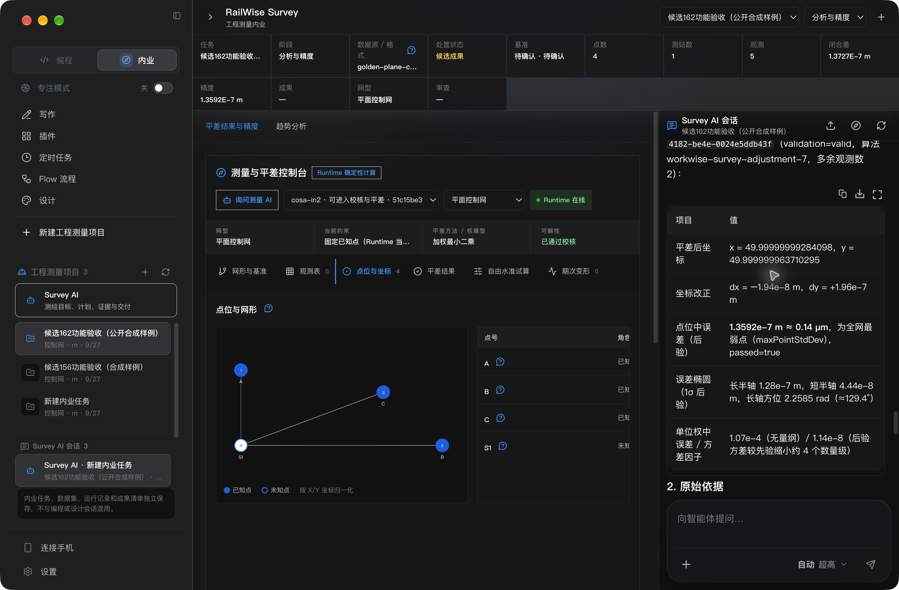

# RailWise AI 0.5.1 / #162 最终候选复验

源码：`8d68df67c16e3020c83dabf2f23f5a403ca5d257`；日期：2026-09-27。

**状态：本轮启动、主题、精确工具读回、重启保全及同源码私有更新检查完成；AI文字解释仍有已记录缺陷，用户本人确认未完成，公开发布门禁未通过。**

本轮接续安装后崩溃、跟随系统深色主题及成果追问验收。此前三包失败分别见 [#156](../railwise-051-final-f518878/README.md)、[#158](../railwise-051-final-9a7cd6c/README.md)、[#161](../railwise-051-final-5e49d220/README.md)。本次修复持久化工具参数摘要被模型抄作真实参数的问题：摘要进入历史结果说明，真实调用参数原样保留，领域严格schema、ID/revision/hash校验不变，没有恢复保存私密参数。

源码验证：参数回归旧代码失败/新代码通过，模型适配器44项通过；Runtime全量2945通过/22跳过；桌面2870通过/2跳过；Runtime类型、构建和改动文件ESLint通过。日志在本目录。此类检查不代替最终包实操。

真实模型参数预检：只用静态虚构 `qa-project / qa-network / S1=(50,50)`、假哈希和合成历史摘要，调用已配置的 `api.deepseek.com / deepseek-v4-pro`；legacy/typed分别只生成一次 `survey_read_context / survey_read_evidence`，严格schema通过且字段与给定引用完全相同，见 `public-fixture-model-preflight.json`。没有执行工具，不等同于最终包GUI读回。最初计划的已有测试会话重放被自动审批以历史数据外发未明确授权为由拒绝，保持未执行；该预检改用无任何保存会话/业务记录的静态数据，通过安全审批。

- [#162 三客户端私有候选](https://github.com/railwise-cn/railwise-ai/actions/runs/36323753207)
- [#163 同源码私有原生updater](https://github.com/railwise-cn/railwise-ai/actions/runs/36323778077)

## 同源码私有原生更新通过

`updater/private-updater.json` 和 `native-updater.json` 均passed：隔离bundle `com.wangjiawei508.workwise.candidate.head8d68df67c16e`，0.0.0→0.5.1，六阶段 base_started、update_available、download_completed、install_requested、target_relaunched、user_data_preserved 全部实际完成，2026-09-27 14:08:31Z结束。数据哨兵保留，cleanup完成；签名、公证、开启的Gatekeeper通过，未打开浏览器、未修改系统信任、未触碰生产或上传公共feed。

下载1次manifest及1次ZIP，共303004280字节；ZIP SHA256 `229ecc5db6f9652e1d9bf9d49981d9b9013dd5a6056e850fc3fd88a4a00bd2fa`，目标/安装后ASAR均 `cbf1172bebeb0f56d9cab4d2be5155c72dabc63e4ebc4f7331814fc329b46299`。这是同源码隔离探针，不是历史版本迁移，也不宣称与正式身份候选#162是相同二进制。frontier只是回环测试标签，没有推广公共渠道。

## 本机最终安装包

2026-09-27 22:29（北京时间）安装至 `/Applications/RailWise AI.app`。包版本0.5.1、arm64、bundle `com.wangjiawei508.workgpt`、Team `R35G7F4A9U`，深度严格签名、stapled公证票据与5个Electron/V8可执行文件权限检查通过，见 [local-package-identity.json](local-package-identity.json)。旧包备份在 `/private/tmp/railwise-pre162-backup/RailWise AI.app`，未删除用户数据。

| 身份项 | SHA256 |
| --- | --- |
| 安装DMG | `9135047c4f68df5eb0e06e18d14d590545e6d17204ed62628dfdd1de5a97f8cc` |
| 安装/DMG内ASAR | `395437bb3792154721af8522f74154c12ecaec3c5d44b806767a72ad992bffd9` |
| 安装/DMG内模型适配器 | `c74ea87628c52c6ef187c495304a3085803740b950fc61680862848b670c727a` |

Runtime在ASAR外，因此不能用与#161相同的ASAR摘要代替Runtime身份检查；本轮另核对三份Runtime模块与摘要修复实际存在。候选更新地址为回环 `https://127.0.0.1/`。下载采用认证的GitHub工件分段提取，已核对DMG CRC及内附SHA256，未完整下载外层ZIP，不声称重算其工件摘要。

## 功能与界面检查

| 检查 | 实际结果与证据 |
| --- | --- |
| 普通启动 | 安装后与正常退出后均通过macOS普通入口启动，Runtime在线；未新增崩溃记录。 |
| 系统主题 | 设置为“跟随系统”，当前系统深色正常；显式明暗切换后恢复system，重启仍为system。见06、13、14证据。 |
| 选定页面尺寸 | 浅色07/08/09、深色11/12/10分别覆盖1280×840、960×640和1920×980逻辑尺寸。最小窗口将AI会话放到下方，主区可滚动；常规为右侧会话，宽屏为完整工作区。工作内容可读。检查结束恢复1280×840。 |
| 原有记录 | 原两个项目、原12条测试消息仍可见；未清除或替换旧成果。 |
| 新合成项目 | 原生GUI创建“候选162功能验收（公开合成样例）”，导入公开仓库IN2黄金样例，校核及平差完成，4点/5观测。 |
| 负例阻断 | 文件选择器最初意外选中 `negative-dms-seconds-60.in2`，实际被invalid-direction阻断并仅归档；记录保留，不能描述为预先计划的负例选择。随后用完整路径选取并核实黄金文件。见02。 |
| 原件定位 | 点击距离观测定位record8、offset103、length11，原文 `B,S,100.000`。见03。 |
| 自动legacy追问 | `turn_kzqucr16` 首次一次 `survey_read_context` 成功，S1结果及来源准确，无schema失败或虚假stale。见04。 |
| 自动typed追问 | `turn_rzemn9y9` 先一次 `survey_read_evidence` resolved，再一次 `survey_read_context` 成功；区分原始初始化点与平差结果。不是仅调用一次工具。见05。 |
| 重启后typed追问 | `turn_m52x0qrf` 同一新合成项目会话重新加载历史后，两工具各一次成功，无 `_workwise_summary` 参数污染、重试或schema失败。见15/16。 |
| 业务只读性 | 重启及第三轮只读问答后9个业务SQLite逻辑摘要、表计数与重启前完全相同。 |

三个追问均点击行级按钮生成原文“请解释 S1 的结果、原始依据及需要复核的问题。”，保留自动引用后显式发送，未手工修补提示词或引用参数。供应商为既有配置 `api.deepseek.com / deepseek-v4-pro`。本轮仅使用新建公开合成项目 `project_a8491009-7a85-4a9c-a4fb-1dc7e255bbba` / `thr_hi3majyy`，未重放原六轮会话。完整可见回答及工具结果以白名单导出至 [real-model-readback.json](real-model-readback.json)，排除隐藏推理。

确定性值：网络 `network_a33e828e-d424-4f9f-9b03-85b751c15be3` rev2，平差 `adjustment_e110cbc8-97b6-4182-be4e-0024e5ddb43f` rev1。S1初值 `(50.00000001228713,49.999999767779975)`，平差值 `(49.99999999284098,49.999999963710295)`，最大后验点位中误差 `1.35921525e-7 m`。源文件SHA256为 `4281cc7a10673570756867e8c8665f22f82611839bd34c396a5eba9dbb89d9f0`，计算输入摘要为 `9fe61f65603fc782215f3a44d76bfe1974fbe4ed383b799e0727b095bec9520d`；二者标识不同内容，不能互换。

**保留的AI解释缺陷：** 三轮回答均把方差因子约`1.14e-8`解释成“后验方差缩小约4个数量级”。正确应为方差约8个数量级，标准差约4个数量级。读取、引用和运行时数值成功不等于整段专业解释完全正确。本轮未修改已保存回答，也不将其作为专业验收结论。后续AI解释语义验收仍需处理此项，完整成果问答验收不能标成全通过。

## 正常退出、重启与数据边界

北京时间22:55起通过原生菜单退出，原Runtime PID63659退出，8787/8788均释放；普通 `open` 入口重新启动后，进入内业恢复三个项目及新项目的五条可见消息，Runtime PID69931同时独占两个回环端口。最新崩溃仍是16:02:41的旧记录。本轮重启未自动恢复内业页面，需点击“内业”；恢复数据不等于恢复全部导航状态。

- [重启前后9库对比](restart-data-comparison.json)：全部一致。
- [第三轮只读问答后9库对比](read-only-data-comparison.json)：全部一致。
- [退出后进程状态](after-quit-state.json)与[重启后状态](post-validation-state.json)。

安装前9库快照与#161正常退出后也全部一致；但安装后、新项目创建前的独立快照漏采，故不声称九库在整个安装窗口内完全未改变。新增项目和导入有意改变engineering/survey两库，不能将相对最早基线的差异误报为重启迁移损坏。上述两个最终对比明确以新项目已建成后的快照为基线。

## 仍未关闭的门禁

本报告限于本轮故障和选定Survey页面；没有完成全部P1/P2、Q01–Q17跨功能问答矩阵、全语言/键盘/可访问性矩阵或两小时稳定门禁。当前UI和功能仍须用户本人对 **0.5.1 / 候选#162 / 源码8d68df67** 亲自确认，AI解释缺陷另行保留。尚不具备公开发布批准条件。

本机Gatekeeper原先关闭且未改变；不能将本机override视作开启策略验收。合成样例不代替仪器/生产/专业签认，隔离updater不代替历史数据迁移。完整P1/P2和广泛UI矩阵保持原待办。用户本人仍须确认精确安装包的UI及功能；未改公开版本、tag、Release、公共feed或官网。
