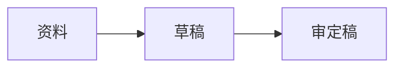

# 语法覆盖

这是 **粗体**、*斜体*、`inline code` 和 ~~删除线~~ 的段落。

- [x] 已完成任务
- [ ] 待处理任务

> 本地 Markdown 文档是唯一权威内容。

```ts
export const sourceOfTruth = 'markdown'
```

## Mermaid source


```mermaid
flowchart LR
  A[资料] --> B[草稿] --> C[审定稿]
```
